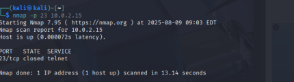

# CyberSecurity_Internship-Elevate_labs-task4
## Project Overview
**Objective:** Configure and test basic firewall rules using UFW to control network traffic flow  
**System:** Kali Linux 
**Testing Environment:** Multi-host network setup with remote testing capabilities
### **Initial System State**
The project began with UFW not installed on the target Kali Linux system. This required package installation before any firewall configuration could proceed.

## Step-by-step Process

## Installing UFW in linux using the command:
`sudo apt update && sudo apt install ufw`

##  Enabling UFW using the command:
`sudo ufw enable`

## Make UFW start on boot using following command:
`sudo systemctl enable ufw`
## Print Status

**Enable logging to monitor firewall activity with the command:**
`sudo ufw logging on`
**Set Default policy in UFW by command:**
`sudo ufw default deny incoming` `sudo ufw default allow outgoing`
**Block Inbound Traffic on Port 23 (Telnet) using command:**
`sudo ufw deny 23/tcp` `sudo ufw deny 23/udp`
**Allow SSH Access (Port 22) by command:**
`sudo ufw allow ssh`
Use other system to test with following command: 
`nmap -p 23 your_ip`

## Success end Result

---

